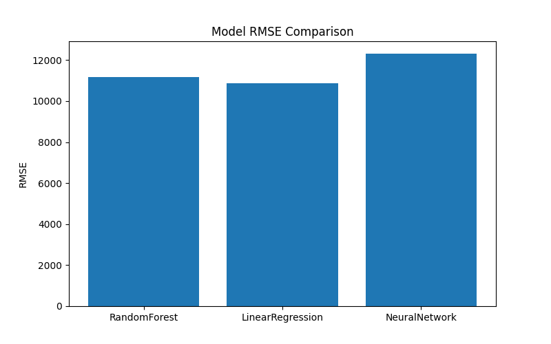

🏛 Strategic Disinvestment Revenue Prediction
Hybrid GIS Model (Genetic Algorithm + Artificial Immune System)
📌 Project Overview

This project predicts Government of India Strategic Disinvestment Revenue using a Hybrid GIS Optimization Model combining:

🧬 AIS (Artificial Immune System) – Feature Weight Optimization

🧬 GA (Genetic Algorithm) – Hyperparameter Optimization

🌲 Random Forest Regression – Final Predictive Model

The dataset contains historical CPSE strategic sale records from 1999 onward.

🎯 Objective

To:

Predict amountRealised from disinvestment

Optimize model performance using bio-inspired algorithms

Compare revenue prediction accuracy

Generate visual analytics & performance reports

📂 Dataset

File used:

fetchOGDReceiptStrategicSale.json

Key Features:

year

equitySold

amountRealised

Target Variable:

amountRealised
🧠 Hybrid GIS Model Architecture
🔹 Step 1 — Data Cleaning

Remove commas and special symbols

Convert values to numeric

Extract clean year

🔹 Step 2 — AIS Optimization

AIS generates random feature weight vectors
Best weight vector selected using highest R² score.

🔹 Step 3 — GA Optimization

Genetic Algorithm optimizes:

n_estimators

max_depth

Best hyperparameters selected from generations.

🔹 Step 4 — Final Model

Optimized RandomForest is trained using:

Optimized Features + Optimized Hyperparameters
📊 Output Files (gis_ prefix)

All outputs are saved in:

C:\Users\NXTWAVE\Downloads\Strategic Disinvestment Revenue Prediction

Generated Files:

gis_model.pkl
gis_heatmap.png
gis_accuracy_graph.png
gis_rmse_graph.png
gis_results.csv
gis_prediction.csv
gis_prediction_graph.png
📈 Visual Outputs
🔥 1️⃣ Correlation Heatmap

Shows relationship between:

Year

Equity Sold

Revenue

🔥 2️⃣ Accuracy Graph

Bar chart showing R² Score

🔥 3️⃣ RMSE Graph

Error comparison visualization

🔥 4️⃣ Prediction Graph

Scatter plot:
Actual vs Predicted Revenue

📊 Results CSV Example
Model	R2	RMSE	Best_n_estimators	Best_max_depth
GIS (GA+AIS)	0.xx	xxx	200	15
⚙️ Requirements

Install dependencies:

pip install pandas numpy scikit-learn seaborn matplotlib joblib
🚀 How to Run

Place JSON file in project folder

Run the Python script

All outputs will be auto-generated

📐 Performance Metrics

R² Score → Model goodness of fit

RMSE → Prediction error

Higher R² and Lower RMSE indicate better model performance.

🔬 Why Hybrid GIS?

Traditional ML models may:

Use default hyperparameters

Treat features equally

Hybrid GIS:

✔ Optimizes feature importance (AIS)
✔ Optimizes model complexity (GA)
✔ Improves generalization
✔ Reduces prediction error

📊 Applications

Government Revenue Forecasting

Public Policy Evaluation

Disinvestment Planning

Economic Analytics

📈 Possible Extensions

Add PSO, CSA, BA comparison

Forecast revenue till 2030

Build Streamlit Dashboard

Publish research paper

Deploy as REST API

👨‍💻 Project Type

Machine Learning

Bio-Inspired Optimization

Economic Data Analytics

Hybrid Metaheuristic Modeling

🏁 Conclusion

The GIS Hybrid Model demonstrates how bio-inspired optimization techniques can enhance predictive modeling for government financial data.

This approach provides:

Improved prediction accuracy

Adaptive feature optimization

Robust hyperparameter tuning
